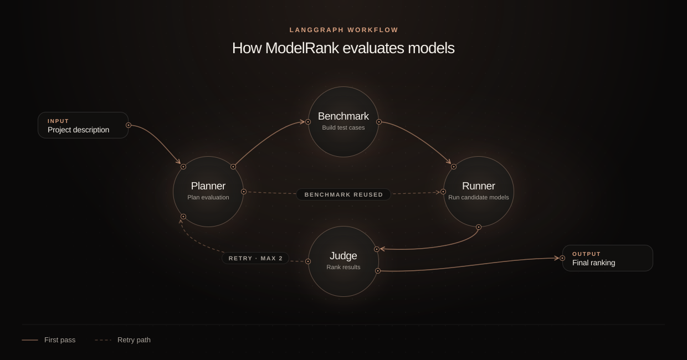

# ModelRank

**Find the model worth building on.**

ModelRank is a multi-agent LLM evaluation system that benchmarks candidate language models against project-specific requirements and ranks the strongest fit based on quality, latency, and cost.

**Developed by Nada Alamri**  
As part of the **Advanced Agentic AI Systems Engineering Program**  
by [**SDAIA Academy**](https://github.com/SDAIAAcademy)

---

## Overview

Choosing the right language model depends on the requirements of the project.

ModelRank automates this process through a multi-agent workflow that:

- understands the user's project
- identifies relevant evaluation criteria
- selects suitable candidate models
- generates a focused benchmark
- evaluates models under the same conditions
- compares quality, latency, and API cost
- ranks the models and selects the best match

---

## How It Works

ModelRank uses four specialized agents:

### Planner Agent

Analyzes the project requirements, identifies evaluation criteria, searches for suitable models, and verifies their OpenRouter model IDs.

### Benchmark Agent

Creates focused, self-contained test cases based on the project's evaluation criteria.

### Runner Agent

Runs candidate models against the same benchmark in parallel and records responses, latency, token usage, cost, and execution errors.

### Judge Agent

Evaluates each response as `PASS`, `PARTIAL`, or `FAIL`, then ranks the models based primarily on benchmark quality, with latency and cost used as additional comparison factors.

<p align="center">
  
</p>

---

## Agent Notebook

For a simplified view of the complete agent workflow without the full backend and frontend implementation, see:

[`ModelRank_Agents.ipynb`](./ModelRank_Agents.ipynb)

The notebook contains the core agents, tools, prompts, and LangGraph orchestration in one place.

The production implementation is organized separately inside the `backend/` directory.

---

## Tech Stack

### AI & Orchestration

- LangChain
- LangGraph
- OpenRouter
- Tavily

### Backend

- Python
- FastAPI
- ReportLab

### Frontend

- React
- Vite
- JavaScript

### Deployment

- Docker
- Docker Compose

---

## Project Structure

```text
ModelRank/
├── backend/
│   ├── agents/
│   ├── data/
│   ├── __init__.py
│   ├── config.py
│   ├── Dockerfile
│   ├── main.py
│   ├── report.py
│   └── workflow.py
│
├── frontend/
│   ├── public/
│   ├── src/
│   ├── Dockerfile
│   ├── index.html
│   ├── package.json
│   ├── package-lock.json
│   └── vite.config.js
│
├── .dockerignore
├── .env.example
├── .gitignore
├── docker-compose.yml
├── ModelRank_Agents.ipynb
├── README.md
└── requirements.txt
```

---

## Setup

### 1. Clone the repository

```bash
git clone https://github.com/nadaalamri-9/ModelRank.git
cd ModelRank
```

### 2. Configure environment variables

Create a `.env` file in the project root:

```env
OPENROUTER_API_KEY=your_openrouter_api_key
TAVILY_API_KEY=your_tavily_api_key
```

### 3. Run with Docker

```bash
docker compose up --build
```

Frontend:

```text
http://localhost:5173
```

Backend:

```text
http://localhost:8000
```

API documentation:

```text
http://localhost:8000/docs
```

---

## Output

ModelRank provides:

- selected best-match model
- ranked candidate models
- PASS / PARTIAL / FAIL results
- average latency
- API cost
- detailed test-case assessments
- downloadable PDF evaluation report

---

## Author

**Nada Alamri**
